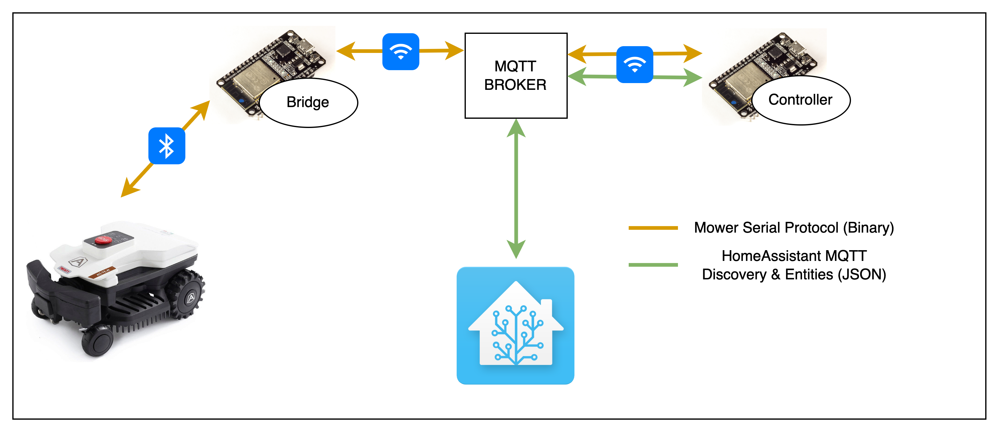
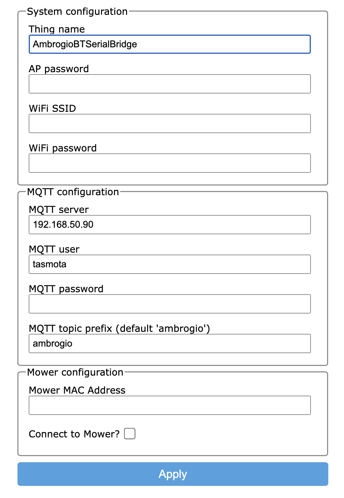
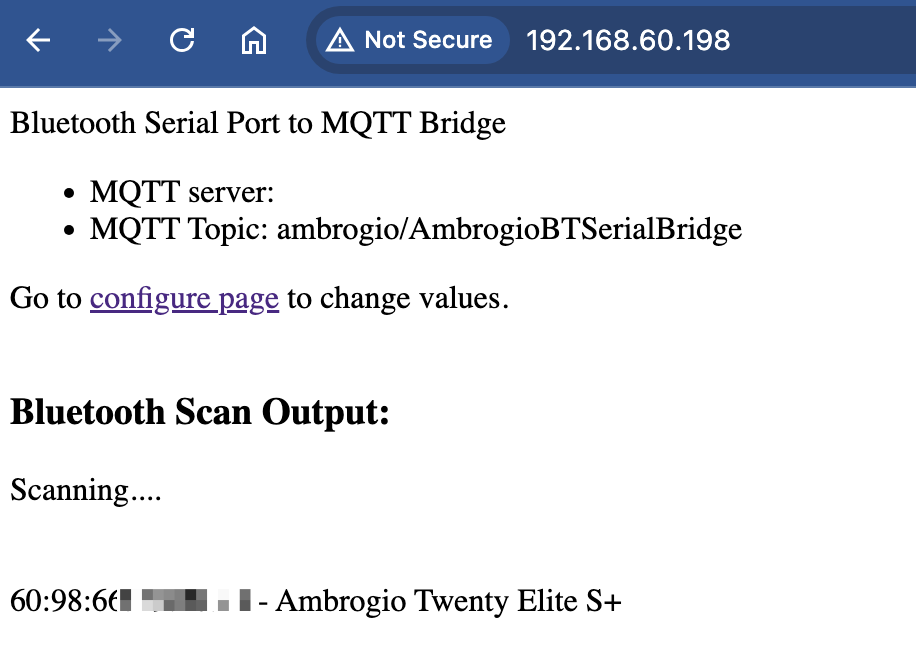
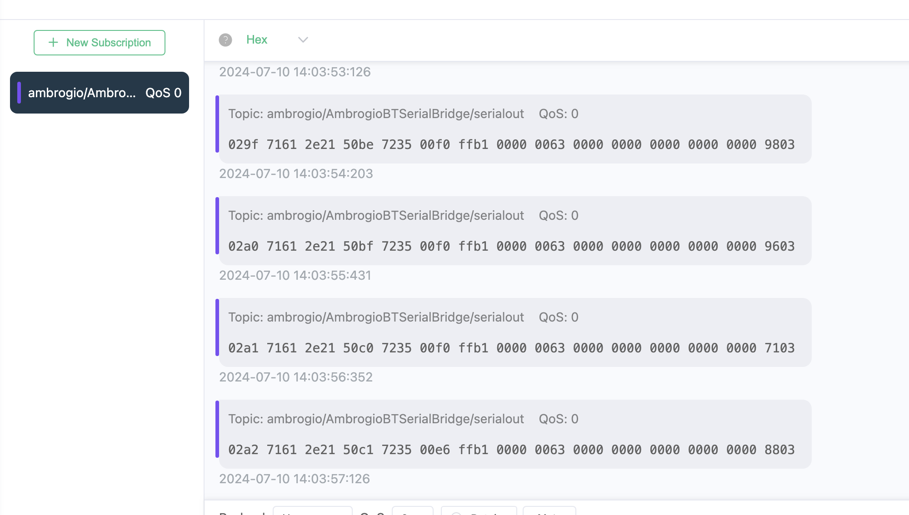
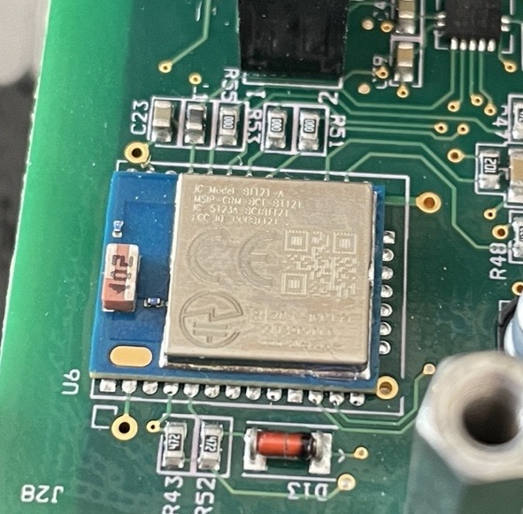
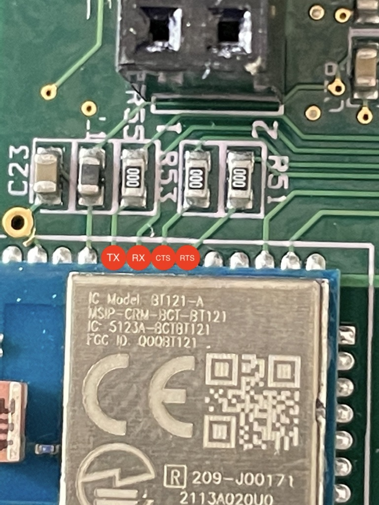
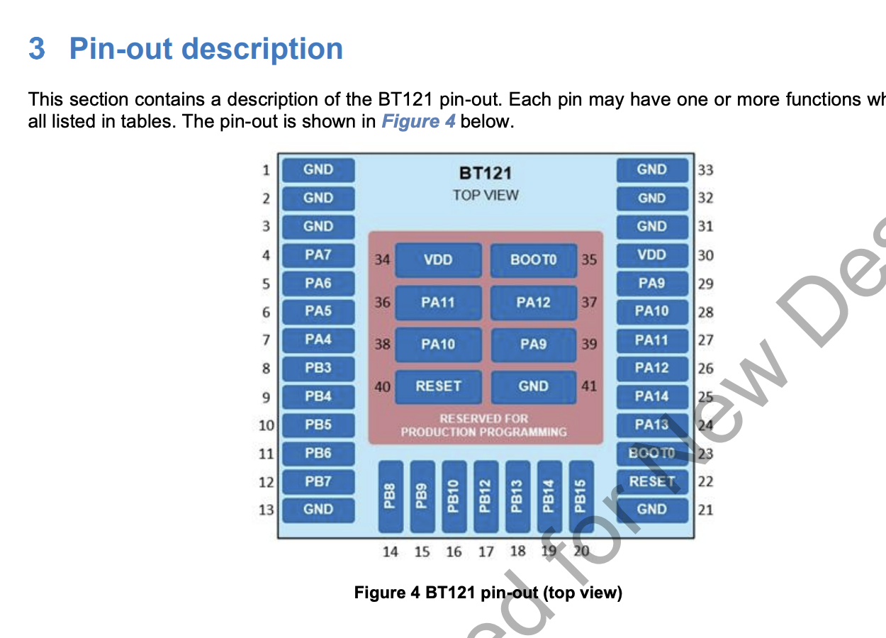
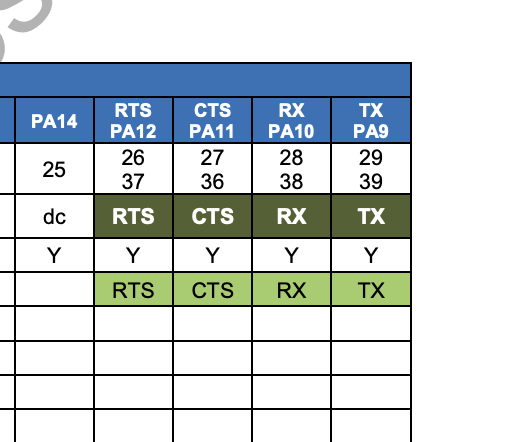

# Bluetooth Serial Port to MQTT Bridge
This project is intended to be used in conjunction with --Ambrogio Mower Controller (link coming soon)-- in order to allow control of AM4000 based mowers via WiFi (and Home Assistant). It connects to your mower via Bluetooth and relays serial data to an MQTT broker.

# Disclaimer
Any useage of this project's software and hardware are at your own risk. This includes any damage done to you or your equipment as well as the loss of warranty when the mower is opened by a non-authorized person.

## Quickstart

Flash the latest release to an original ESP32 module (S3, C3 etc. do not support Bluetooth Classic). The module will then start as a WiFi access point with the network name (SSID) starting ESP_XXXXXX.

Connect to this WiFi network and you will be directed to a page to enter your network and MQTT broker details:

| Setting | Description |
| - | :- |
| Thing Name | The name of your mower. This will for part of the MQTT topic and should be unique |
| AP password | This is used to protect the WiFi network that is advertised in fallback AP mode, and to access the firmware update page |
| WiFi SSID | The name of your WiFi (this must be typed in as the library used does not have scanning functionality) |
| WiFi Password | The password to the above WiFi network |
| MQTT Server | The IP address of the MQTT broker |
| MQTT User | The username to connect to the broker |
| MQTT Password | The password of the above user |
| MQTT Topic Prefix | The base topic to use, the default of ambrogio is usually appropriate |
| Mower MAC Address | Unless you already know the Bluetooth MAC address of your mower, leave this blank and the bridge will scan for it |
| Connect to Mower | Controls whether the bridge should connect to the mower. As only one BT connection is supported at a time, this is used to allow connection from the original App |

Hit apply and the bridge will reboot and connect to the WiFi network and MQTT broker specified. At this point you should be able to find the IP address that has been assigned to your bridge from your router or it will be displayed in the serial port monitor. Any problems (incorrect passwords etc.) will also be displayed on the serial monitor.

Once connected successfully, browse to the bridge via IP.

Keep refreshing the page until the mower is found. The mower needs to be relatively close for it to be discovered (up tp around 10-15 metres). Copy the MAC address of your mower, go to the 'configure page', then enter it in the MAC address box and apply.

The bridge will reboot and start trying to connect to your mower. If any of the connections drop (WiFi/MQTT/Bluetooth), the bridge will indefinitely try and re-establish them. 

At this point you should be able to subscribe to the 'serialout' topic using an MQTT client and view the data the mower is outputting. The base topic is shown on the home page (ambrogio/AmbrogioBTSerialBridge in the above example), so just add /serialout to get the full topic. i.e ambrogio/AmbrogioBTSerialBridge/serialout

That's it! The next step is to build a controller that can process the serial output and send commands to the mower. (Instructions coming soon)

## Module Placement

Once connected, the bluetooth range is considerably better than during discovery. Distances up to about 40m line-of-sight have been stable, so depending on your lawn layout and dimensions, you may simply need to position the bridge appropriately. If the connection is dropped however, it will struggle to re-establish until the mower is withing about 20m.

If your lawn is bigger than this, you could try multiple bridges configured with the same thing name, and therefore the same topic. This has not been tested, however.

Another option if you have full WiFi coverage of your lawn is to place the module inside the mower. The programming header has GND and 5V pins (the right-most pins in this image). This has not been tested, however.

## Background
Ambrogio manufacture several models of mower (I have a Twenty Elite S+) based on the AM4000 control board. These mowers can be configured/controlled via App which can communicate in one of two ways:
- Via Bluetooth, allows full configuration and control of the mower but is quite limited in range (up to about 10m).
- Via a 'Connect' module which is pre-installed in some models or can be added as an extra on others. This uses cellular data and requires a subscription. The connect module also provides GPS functionality. The control options are also very limited using this method and updates can be slow.

I wanted to be able to monitor and control my mower using homeassistant, and there is a great integration that does this via the ZCS cloud and Connect module (https://github.com/ufozone/ha-zcs-mower), but this comes with the limitations mentioned above.

There is also the [Robotan project](https://github.com/fredlcore/Robotan) that interfaces with the Serial port on older models, which unfortunately does not exist on the AM4000 (See note [here](https://github.com/fredlcore/Robotan/blob/master/Supported%20Models.md)). The author of that project did give me a jump start on decoding the protocol, which was immensely helpful for the other half of the project, the controller.

## Bluetooth Serial
Although there is no convenient serial port like on previous models, I was hopeful the serial data would be available on a header or test pads somewhere on the board. The AM4000 uses a BT121-A bluetooth chip for communication, which according to the data sheet has the Serial Port on pins 26-29

  

I couldn't find anywhere on the board that these lines were exposed conveniently, but I was able to tap into them directly from the chip and read the serial data, but whenever I tried to transmit, it locked up the mower and it needed to be restarted. My electronics skills and willingness to potentially brick my mower ended there so I looked at connecting as the App does, via Bluetooth.

Connections from the App are made via Bluetooth Classic using Serial Port Profile (SPP). Handily, an ESP32 (original, S3, C3 etc. only support BLE) has support for SPP through the [BluetoothSerial](https://github.com/espressif/arduino-esp32/tree/master/libraries/BluetoothSerial) library.

# FAQ

### Why not have the controller and bridge on the same device?
- The Arduino Bluetooth stack takes up a LOT of the available memory on the ESP32. Adding the controller functionality on the same module was causing instability

